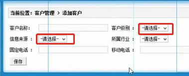
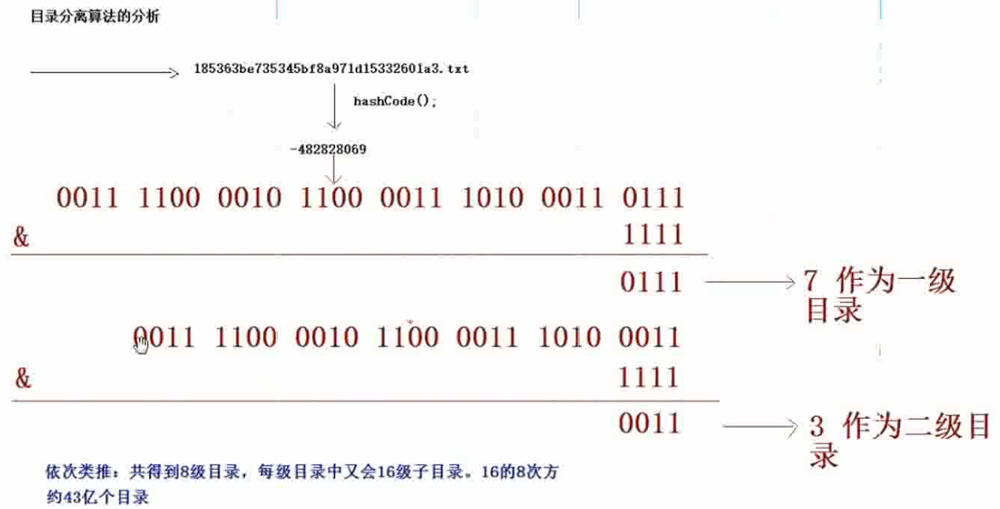

# CRM
A CRM Project (ON Web) from Self-learning.


> 系统开发的步骤、流程，以及一些注意点


&nbsp;

### 环境

- 项目，Jar包

- Struts：struts.xml,web.xml中的核心过滤器

- Hibernate：Spring托管，映射文件保留

- Spring：applicationContext.xml，web.xml核心监听器

- properties：JDBC连接，log4j

  ```xml
  <!-- spring核心监听器 -->
  <listener>
      <listener-class>org.springframework.web.context.ContextLoaderListener</listener-class>
  </listener>
  <context-param>
      <param-name>contextConfigLocation</param-name>
      <param-value>classpath:applicationContext.xml</param-value>
  </context-param>
  <!-- struts核心过滤器 -->
  <filter>
      <filter-name>struts2</filter-name>
      <filter-class>org.apache.struts2.dispatcher.ng.filter.StrutsPrepareAndExecuteFilter</filter-class>
  </filter>
  <filter-mapping>
      <filter-name>struts2</filter-name>
      <url-pattern>/*</url-pattern>
  </filter-mapping>
  ```

- 包结构等

&nbsp;

### 开发

#### 用户模块

- 传统的Web(Action)-Service-Dao分层；Spring配置Bean，Action交给Spring进行配置，注入Service；Service中注入Dao，Dao使用HibernateDaoSupport进行Hibernate模板操作的支持——同时需要在Dao的Bean声明中注入一个SessionFactory。
- Action使用Struts的模型驱动，从表单数据封装到私有属性中（需要在Action中提供一个已实例化的对象）；
- 加密处理：MD5对登录控制中的密码进行加密后，转存到数据库中，使用一个MD5Utils的工具类。
- 事务管理：在所有Service中需要进行事务控制的地方，配置事务管理。Spring中配置事务管理器(提供sessionFactory属性的注入)，开启事务管理。在需要的Service类中，打上注解`@Transactional`

#### 客户管理

- 能够对客户信息的CRUD，分页条件查询等。

- 客户的某些属性，如来源、行业、等级等，应该是一些实际的阈值或枚举值。在开发中引入一个字典，对这些数据进行封装，在数据库设计中体现为一个单独的**数据字典表**。这个表的某些字段被客户所参照。

- 进入客户管理页面时，使用JQuery异步加载完成一些字典数据的查询——不过这个过程需要多次查询数据库？这个变化不大的数据，其实可以使用缓存或者直接写死也行。

  ​	

- 注意：对数据进行增删改的操作时，务必使用事务进行注解。使用Spring进行Hibernate的整合和模板操作后，事务不配置的话，默认是对数据库进行只读操作的，若不加事务注解（service层）进行处理，则会报错

- **分页查询**：使用detachedcriteria离线，进行分页查询。同时支持带条件查询，增加代码的复用性；

- 查询操作做了分页处理，自定义分页对象PageBean，包含了当前页、总页数、总记录数、当前查询结果的集合等参数。分页查询结果的显示，需要**开启Spring的OpenSessionViewFilter过滤器**，来实现数据库Hibernate的关联查询的延迟加载问题。

- **文件上传**：

  - 上传文件的方法：1）JSPsmartUpload；2）FileUpload工具插件（Web实战中使用）；3）Servlet V3.0版本支持；**4）Struts2的文件传输支持**

  - Struts2实现的文件上传，底层是FileUpload的实现，一层封装更方便使用。

  - 文件上传的3要素：1）表单的Post方法；2）提供\<input type=”file” name=“upload”>且上传的文件必须有name属性和值；3）表单的enctype属性必须是multipart/form-data

  - enctype属性表示传送文件的内容，否则只有文件名作为参数传到服务器。

  - Struts2上传文件，经过一个`fileupload`的过滤器，会获得表单项的名字name如file，包装三个参数file+FilenNme/file/file+ContentType，分别表示文件名、文件、文件类型；在获取的Action中提供同样的三个参数和Set方法，就可以使用自动属性注入。

  - 目录与文件名操作和Web实战中类似：

    

  - Struts的文件上传中，能够实现拦截器对文件大小、文件拓展名等的约束，需要在配置文件中单独设置FileUpLoadInterceptor。注意出错返回时，配置一个input的返回定向。

    ```xml
    <action name="customer_*" class="customerAction" method="{1}">
        <result name="saveUI">/jsp/customer/add.jsp</result>
        <result name="findAll">/jsp/customer/list.jsp</result>
        <result name="saveSuccess" type="redirectAction">customer_findAll.action</result>
        <!-- input错误 转向-->
        <result name="input">/jsp/customer/add.jsp</result>
        <interceptor-ref name="defaultStack">
            <param name="fileUpload.maximumSize">2*1024*1024</param>
            <param name="fileUpload.allowedExtensions">.jpg</param>
        </interceptor-ref>
    </action>
    ```

- 修改客户信息时的数据回显

  - 将查询到的客户对象手动压入值栈中，到前台页面可以使用Struts标签自动回显或者普通标签使用OGNL表达式填充标签的value值

  - Action模型驱动的模型对象model，包含了一个客户对象；在普通标签中还可以使用model.属性名的方式获取

    ```java
    <s:textfield id="sChannel2" cssClass="textbox" cssStyle="WIDTH: 180px" maxLength="50" name="cust_phone" value="%{model.cust_phone}"/>  
    ---------//压栈后不需要使用value="%{model.cust_phone}"也行
    ActionContext.getContext().getValueStack().push(customer); 
    ```

  - JS无法直接获取值栈的数据，异步加载的数据，使用EL表达式获取值栈的数据

  - 修改客户信息时，需要在表单中单独获取文件路径和设置id——使用隐藏的input组件。文件要先处理是否重新上传，若是则删除之前的。

- 条件查询：使用查询分页的离线查询，只需在Web层将条件添加适当的需要即可。同时在条件选择器中进行数据回显，否则会因没有条件在翻页时出错


#### 联系人管理

- 类似的CRUD操作
- **级联删除**，在客户删除的时候，**先查询再删除**。在客户的映射端（也就是Set集合上）进行配置cascade=“delete”；Hibernate默认删除时，将被参照的外键置为null；
- **修改客户的时候，联系人的客户的信息就丢失了**：因为在修改客户的时候，没有查询联系人的集合，当点击修改，修改客户（修改客户所关联联系人）因为联系人的集合是空，所以将外键置为null。**解决**：在客户（1的一方）端放弃外键的控制，在set配置上添加inverse=“true”；


#### 问题：

1. 页面返回跳转是redirect时，actionerror的值就获取不到了么？不是，actionerror在值栈中。